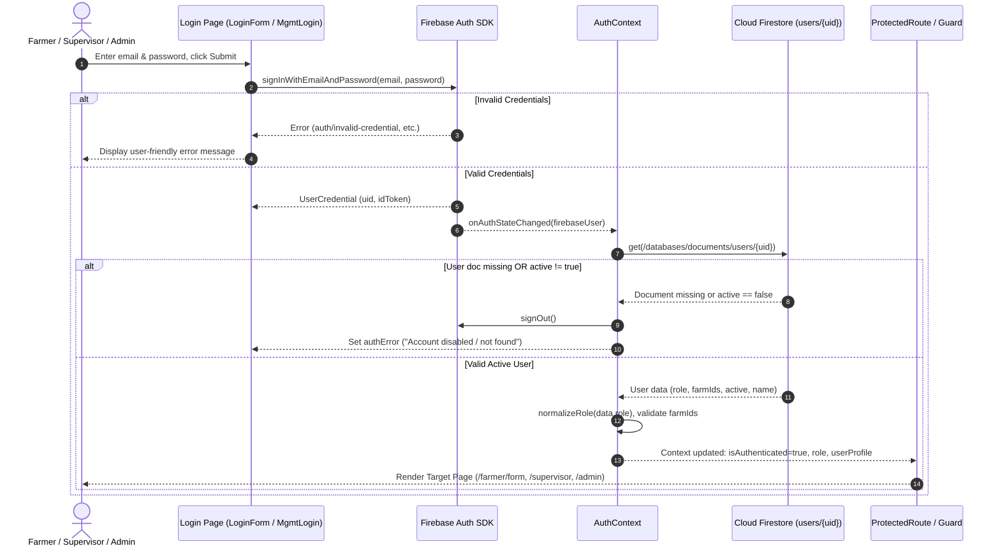
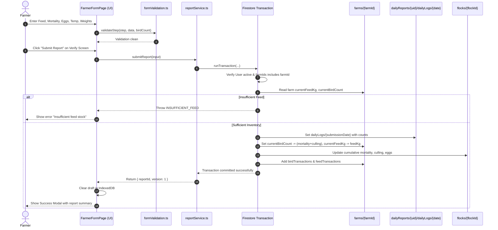
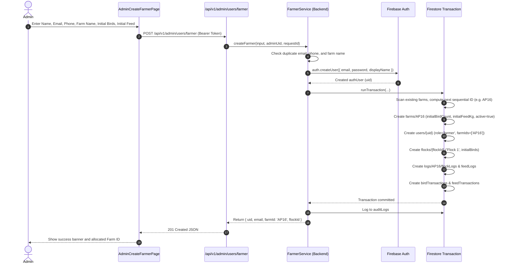
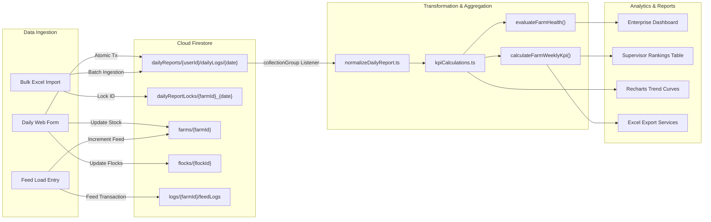

# Application Flow — Current System

## 1. Document Purpose

This document provides an exhaustive, evidence-based operational flow of the **SAI Happy Farms ERP** application as it exists in the codebase today. It acts as the primary behavioral context memory for engineers and future AI coding agents, ensuring that all subsequent modifications preserve architectural integrity, data consistency, and existing user workflows.

- **Audit Date:** 01 October 2026
- **Current Git Commit / Version:** `9bd4a4d` (Monorepo root: `sai-happy-farms-erp` v1.0.0, Frontend v0.0.0, Backend API v1.0.0)
- **Primary Source-of-Truth Rule:** The actual executable code (`frontend/src/`, `backend/src/`, `firestore.rules`, and configuration files) takes precedence over all informal notes, comments, and the historical Software Requirements Specification (`Option_2_Local_Language_Web_Form_SRS.md`).
- **Scope & Limitations:** Covers the React single-page application (Farmer, Supervisor, and Admin portals), the Node.js/Express backend API, and direct client/backend integrations with Firebase Authentication, Cloud Firestore, and browser IndexedDB offline persistence.

---

## 2. System Overview

SAI Happy Farms ERP is a centralized poultry farm operations platform designed to eliminate paper registers, WhatsApp photo submissions, and manual Excel consolidation. The system captures daily layer flock performance data, automates feed inventory and bird mortality tracking, enforces operational data validation, calculates industry Key Performance Indicators (KPIs), evaluates farm health, and produces automated performance rankings and exports.

### 2.1 Actual Implemented User Roles
1. **Farmer:** Responsible for submitting daily operational logs (bird count, mortality, culling, feed consumption, egg collection, egg grading, temperature, optional weights, and remarks) in their preferred local language. Restricted to assigned farms.
2. **Supervisor:** Oversees a cluster of assigned farms (`farmIds`). Reviews daily submissions, monitors real-time analytics, compares production metrics against standard breed curves (`CF_STD` / `FR_STD`), and evaluates farms using the 5-parameter ranking engine.
3. **Admin:** Full access across all farms. Manages farmer, supervisor, and administrator user accounts, creates farms and flocks, records feed shipments (`feed-load`), runs historical data imports and rollback operations, and views predictive production forecasts.
4. **Office Staff (Backend API Only):** Recognized in `backend/src/types/auth.ts` as `office_staff` with read-only report access, but not implemented as a dedicated frontend UI route.

### 2.2 System Architecture Diagram

```mermaid
flowchart TD
    subgraph Client["Frontend Client (Vite + React 19 + TypeScript)"]
        F_UI["Farmer Portal (/farmer/form)"]
        S_UI["Supervisor Portal (/supervisor/*)"]
        A_UI["Admin Portal (/admin/*)"]
        AUTH_CTX["AuthContext & Role Guard"]
        SVC_FRONT["Frontend Services (reportService, farmDataService, etc.)"]
        IDB["Browser IndexedDB (happy_farm_offline_db)"]
    end

    subgraph Firebase["Firebase Managed Infrastructure"]
        FAUTH["Firebase Authentication"]
        RULES["Cloud Firestore Security Rules"]
        FS_USERS["Firestore: /users"]
        FS_FARMS["Firestore: /farms (+ feed/birdTransactions)"]
        FS_FLOCKS["Firestore: /flocks"]
        FS_REPORTS["Firestore: /dailyReports (+ dailyLogs)"]
        FS_LOCKS["Firestore: /dailyReportLocks"]
        FS_LOGS["Firestore: /logs/{farmId}/*"]
        FS_BATCHES["Firestore: /importBatches"]
        FS_AUDIT["Firestore: /auditLogs"]
    end

    subgraph Backend["Backend API (Node.js + Express + Firebase Admin)"]
        API_ROUTER["Express API (/api/v1/*)"]
        API_ADMIN["Admin Controller (/users, /import)"]
        API_REPORTS["Reports Controller (/daily, /export)"]
        API_FARMS["Farms & Flocks Controllers"]
    end

    F_UI --> AUTH_CTX
    S_UI --> AUTH_CTX
    A_UI --> AUTH_CTX
    AUTH_CTX --> FAUTH
    AUTH_CTX --> FS_USERS

    F_UI --> SVC_FRONT
    S_UI --> SVC_FRONT
    A_UI --> SVC_FRONT

    SVC_FRONT -.->|Offline Queue & Drafts| IDB
    SVC_FRONT -->|Direct Firestore SDK Writes & Listeners| RULES
    RULES --> FS_USERS
    RULES --> FS_FARMS
    RULES --> FS_FLOCKS
    RULES --> FS_REPORTS
    RULES --> FS_LOCKS
    RULES --> FS_LOGS
    RULES --> FS_BATCHES

    A_UI -->|Privileged Management HTTP Calls| API_ROUTER
    S_UI -->|Excel Export HTTP Call| API_ROUTER
    API_ROUTER --> API_ADMIN
    API_ROUTER --> API_REPORTS
    API_ROUTER --> API_FARMS
    API_ADMIN --> FAUTH
    API_ADMIN --> FS_USERS
    API_ADMIN --> FS_FARMS
    API_ADMIN --> FS_AUDIT
    API_REPORTS --> FS_REPORTS
```

---

## 3. Application Startup Flow

The frontend bootstrapping sequence occurs as follows:

1. **HTML Document Load (`frontend/index.html`):**
   - The browser downloads fonts and three Firebase Compat SDK scripts via Google CDN (`firebase-app-compat.js`, `firebase-auth-compat.js`, `firebase-firestore-compat.js` v12.18.0).
   - An inline script in `index.html:16-29` initializes the default Firebase app using `window.firebase.initializeApp(...)` with project configuration `farm-form`.
2. **Module Entry Point (`frontend/src/main.tsx:1-14`):**
   - Initializes the internationalization framework (`import './i18n'`), setting up `i18next` with language detector (`localStorage` key: `sai_language`) and bundles for `en`, `te`, `ta`, `kn`, `hi`.
   - Mounts React 19 `StrictMode` with top-level `ErrorBoundary` (`frontend/src/components/dashboard/ErrorBoundary.tsx:1-68`) wrapping the root `App` component.
3. **App Initialization & Root Providers (`frontend/src/App.tsx:208-216`):**
   - Wraps routes with `BrowserRouter` and `AuthProvider` (`frontend/src/context/AuthContext.tsx:30-157`).
4. **Auth State Detection (`frontend/src/context/AuthContext.tsx:37-139`):**
   - `getFirebaseAuth().onAuthStateChanged` listens for the current Firebase Auth user token.
   - If no user token exists: sets `loading: false`, `firebaseUser: null`, `userProfile: null`.
   - If an Auth token is detected: calls `getUserProfile(user.uid)` from `frontend/src/services/userService.ts:14-51`.
   - Reads `users/{uid}` from Firestore: validates that `active === true`, extracts `role`, and normalizes `farmIds`.
   - If profile document is missing, disabled, or unconfigured: triggers `auth.signOut()`, records an authentication error, and redirects to login.
5. **Initial Routing & Screen Resolution (`frontend/src/App.tsx:34-40` & `frontend/src/utils/routeByRole.ts:1-10`):**
   - Path `/` renders `RootRedirect`:
     - If `loading === true`: renders `LoadingScreen`.
     - If `!isAuthenticated`: navigates to `/login` with `replace: true`.
     - If authenticated: redirects to the role home screen:
       - `farmer` $\rightarrow$ `/farmer/form`
       - `supervisor` $\rightarrow$ `/supervisor`
       - `admin` $\rightarrow$ `/admin`

---

## 4. Complete Authentication Flow

### 4.1 Login Pathways
The application provides two separate login interfaces:
1. **Farmer Login (`/login` via `frontend/src/pages/LoginPage.tsx` & `LoginForm.tsx`):**
   - Designed for farm workers.
   - Input: Email and Password.
   - Executes `loginUser(email, password)` (`frontend/src/services/authService.ts:3-8`) invoking `auth.signInWithEmailAndPassword`.
   - On success, `AuthContext` detects auth change, fetches `users/{uid}`, verifies role is `farmer`, checks that `profile.farmIds.length > 0`, and redirects to `/farmer/form`.
2. **Management Login (`/management/login` via `frontend/src/pages/management/ManagementLoginPage.tsx`):**
   - Designed for administrative and supervisory staff.
   - Features role tabs: `Supervisor` vs `Admin`.
   - Input: Email and Password.
   - Authenticates with Firebase Auth, then explicitly fetches `getUserByUid(uid)` (`frontend/src/services/userDataService.ts:14-29`).
   - Validates that:
     - Profile exists and `active === true`.
     - Farmers are explicitly rejected ("Farmers must use the Farmer Login portal").
     - The account role strictly matches the selected tab (`supervisor` or `admin`).
   - Redirects to `/supervisor` or `/admin`.

### 4.2 Authentication Flow Sequence

### 4.3 Session Restoration & Token Expiry
- Session persistence is handled by Firebase Auth Local Persistence (`localStorage`/`IndexedDB`).
- On browser tab refresh, `onAuthStateChanged` emits the cached session immediately.
- `AuthContext` re-fetches the user document from Firestore to ensure the account has not been deactivated or had farm permissions revoked since the last token refresh.

### 4.4 Logout Flow
- Initiated via `logoutUser()` (`frontend/src/services/authService.ts:10-13`) or the header logout button.
- Invokes `auth.signOut()`.
- `onAuthStateChanged` receives `null`: resets context state.
- Route guards trigger redirect to `/login` or `/management/login`.

---

## 5. Role-Based Application Flows

### 5.1 Farmer Role
- **Base Route:** `/farmer/form`
- **Guarded By:** `<ProtectedRoute allowedRole="farmer">` (`frontend/src/components/ProtectedRoute.tsx:11-35`).
- **Access Restrictions:** Restricted to the single farm assigned to them (`userProfile.farmIds[0]`).
- **Core Activities:**
  - Enter daily layer production reports across a 3-step wizard.
  - Review live inventory calculations (feed stock, live birds).
  - Submit reports for "Today" or "Yesterday" (Indian Standard Time).
  - Submit revision (Version 2) to correct same-day data.
  - Switch display language dynamically (`en`, `te`, `ta`, `kn`, `hi`).

### 5.2 Supervisor Role
- **Base Route:** `/supervisor` (renders `SupervisorDashboard`)
- **Guarded By:** `<ProtectedManagementRoute allowedRoles={['supervisor']}>` (`frontend/src/components/ProtectedManagementRoute.tsx:11-34`).
- **Accessible Sub-Routes:**
  - `/supervisor/overview` $\rightarrow$ Enterprise dashboard summary for assigned farms.
  - `/supervisor/farms` $\rightarrow$ Farm directory list.
  - `/supervisor/farms/:farmId` $\rightarrow$ Detailed farm operational view, flock tabs, and inventory.
  - `/supervisor/analytics` $\rightarrow$ Enterprise analytics dashboard (`variant="analytics"`).
  - `/supervisor/rankings` $\rightarrow$ 5-Parameter Farm Performance Ranking engine and weekly exports.
  - `/supervisor/submissions` $\rightarrow$ Log of daily submissions filtered by assigned farms.
  - `/supervisor/feed-load` $\rightarrow$ Allows recording feed delivery shipments for assigned farms.
- **Data Scoping:** All queries are filtered by `userProfile.farmIds`. Supervisors cannot view or manipulate farms outside their allocation.

### 5.3 Admin Role
- **Base Route:** `/admin` (renders `AdminDashboard`)
- **Guarded By:** `<ProtectedManagementRoute allowedRoles={['admin']}>`.
- **Accessible Sub-Routes:**
  - `/admin/overview` $\rightarrow$ Global enterprise dashboard across all farms.
  - `/admin/users` $\rightarrow$ User directory (farmers, supervisors, admins).
  - `/admin/users/create-farmer` $\rightarrow$ Create farmer, allocate sequential Farm ID, initial birds, and feed.
  - `/admin/users/create-supervisor` $\rightarrow$ Create supervisor and allocate farms.
  - `/admin/users/create-admin` $\rightarrow$ Create new system administrator.
  - `/admin/users/edit-supervisor/:userId` $\rightarrow$ Modify farm allocation for supervisors.
  - `/admin/farms` & `/admin/farms/:farmId` $\rightarrow$ Global farm directory and detailed status.
  - `/admin/flocks` $\rightarrow$ View, create, and manage flock life cycles.
  - `/admin/prediction` $\rightarrow$ Statistical egg production forecasting engine.
  - `/admin/analytics` $\rightarrow$ Global enterprise analytics dashboard.
  - `/admin/submissions` $\rightarrow$ Global submissions audit.
  - `/admin/import` $\rightarrow$ Bulk historical Excel import, conflict resolution, and batch rollback.
  - `/admin/feed-load` $\rightarrow$ Record feed deliveries for any farm in the system.

---

## 6. Complete Module-by-Module Flow

### Module 6.1: Farmer Daily Report Submission
- **Purpose:** Digitize daily farm logs, update live bird and feed inventories atomically, and maintain an immutable historical record.
- **Entry Point:** `frontend/src/pages/FarmerFormPage.tsx`
- **Multi-Step Form Wizard:**
  1. *Step 1: Feed & Health:* Feed consumed (kg/g), mortality count, culling count. Displays dynamic feed consumption in grams per bird.
  2. *Step 2: Eggs & Temperature:* Total eggs produced, table selection eggs, damaged eggs, floor eggs, ambient temperature (min/max).
  3. *Step 3: Weights & Remarks:* Egg weight sampling (min, max, avg), weekly body weight sampling (optional on daily submissions), ammonia levels (ppm), operator remarks.
  4. *Step 4: Verify Screen:* Read-only review card summarizing all calculated KPIs (Production %, Mortality %, Culling %, Selection %, Feed/Bird).
- **Validation Engine:** `frontend/src/utils/formValidation.ts:validateStep()`
  - Enforces non-negative integers.
  - Mortality cannot exceed opening eligible bird count.
  - Mortality + Culling cannot exceed opening eligible bird count.
  - Egg production cannot exceed 95% of opening bird count.
  - Selection eggs + Damaged eggs cannot exceed total egg production.
  - Temperature range: 10°C to 50°C; Min temperature $\le$ Max temperature.
  - Egg weight range: 30g to 80g; Min egg weight $\le$ Max egg weight.
  - Ammonia max: 50 ppm.
  - Date window: Only "Today" or "Yesterday" (Asia/Kolkata timezone) allowed.
- **Critical Threshold Triggers:**
  - If mortality $\ge$ opening bird count (100% loss): triggers modal confirmation `<TotalMortalityConfirmationModal>`.
  - If mortality rate $\ge$ 5%: displays amber operational warning banner.
  - If mortality rate $\ge$ 10%: displays red critical mortality alert.
- **Database Operations (Atomic Transaction):** `frontend/src/services/reportService.ts:submitReport()`
  - Reads `users/{userId}`, `dailyReports/{userId}/dailyLogs/{submissionDate}`, `flocks/{flockId}`, and `farms/{farmId}`.
  - Verifies farm assignment and inventory initialization (`farmData.inventoryInitialized === true`).
  - Checks feed availability (`currentFeedKg >= feedKg`).
  - Computes opening and closing bird counts: $\text{closing} = \text{opening} - (\text{mortality} + \text{culling})$.
  - Writes:
    - `dailyReports/{userId}/dailyLogs/{submissionDate}` (daily log document)
    - `dailyReports/{userId}` (parent summary document)
    - `farms/{farmId}` (updates `currentBirdCount`, `currentFeedKg`, `totalFeedConsumedKg`, `inventoryUpdatedAt`)
    - `flocks/{flockId}` (updates `currentBirds`, cumulative mortality, culling, eggs)
    - `farms/{farmId}/birdTransactions/{txId}` (type `MORTALITY` or `CULLING`)
    - `farms/{farmId}/feedTransactions/{txId}` (type `FEED_USAGE`)
    - `dailyReportLocks/weekly_{farmId}_W{weekNumber}` (if body weight or ammonia submitted)
- **Revision / Overwrite Flow (Version 2):**
  - If report already exists for the selected date and is not finalized:
  - Prompts user with `<OverwriteConfirmationModal>`.
  - Re-reads initial report, archives it to `dailyReports/{userId}/dailyLogs/{submissionDate}/revisions/v1`.
  - Calculates net deltas: $\Delta \text{Feed}, \Delta \text{Birds}$.
  - Updates farm inventory with net difference.
  - Sets `submissionVersion: 2`, `status: 'corrected'`. Max allowed versions = 2.
- **Offline Fallback:** `frontend/src/services/offlineDraftService.ts`
  - Form drafts auto-save to browser `IndexedDB` (`happy_farm_offline_db` $\rightarrow$ `drafts`).
  - If `navigator.onLine === false`: saves complete submission to `pendingSubmissions` queue with status `PENDING_SYNC`.
  - Listens for online event to flush pending submissions via `syncPendingSubmissions()`.

---

### Module 6.2: Supervisor Farm Performance & Rankings
- **Purpose:** Evaluate and rank assigned farms using the 5 customer-documented parameters across configurable date windows.
- **Entry Point:** `frontend/src/pages/supervisor/SupervisorRankingsPage.tsx`
- **Data Query:** `useDailyReportsByFarms(assignedFarmIds, startDate, endDate)` (`frontend/src/hooks/useDailyReports.ts:61-160`)
  - Subscribes via Firestore `collectionGroup('dailyLogs')`.
  - Filters records by assigned farm IDs and ISO date range.
  - Normalizes fields across variations via `frontend/src/utils/normalizeDailyReport.ts:normalizeReport()`.
- **5 Parameter Ranking Implementation:** `frontend/src/utils/kpiCalculations.ts:calculateFarmWeeklyKpi()`
  1. *Production Gap % (Weight 35%, Preferred: Higher):* $\text{Actual Production \%} - \text{Standard 80\%}$.
  2. *Feed Conversion Ratio (FCR) (Weight 25%, Preferred: Lower):* $\text{Feed Consumed (kg)} \div [(\text{Eggs Produced} \times \text{Avg Egg Weight (g)}) \div 1000]$.
  3. *Egg Damage % (Weight 20%, Preferred: Lower):* $(\text{Damaged Eggs} \div \text{Eggs Received}) \times 100$.
  4. *Mortality % (Weight 10%, Preferred: Lower):* $(\text{Mortality Birds} \div \text{Eligible Starting Flock}) \times 100$.
  5. *Selection % (Weight 10%, Preferred: Higher):* $(\text{Selected Eggs} \div \text{Eggs Produced}) \times 100$.
- **Tie-Breaker Hierarchy:**
  - Production Gap tie $\rightarrow$ Lower FCR wins.
  - FCR tie $\rightarrow$ Higher Production Gap wins.
  - Egg Damage tie $\rightarrow$ Higher Selection % wins.
  - Mortality tie $\rightarrow$ Higher Production Gap wins.
  - Selection tie $\rightarrow$ Lower FCR wins.
  - Total flock loss (100% mortality) is penalized to never outrank viable farms.
- **Tabs & Export:**
  - *Rankings Tab:* Displays position, badges, KPI chips, and rank breakdowns.
  - *Weekly Data Tab:* Shows aggregate inputs (Feed, Eggs, Received, Damage, Selection, Mortality, Avg Egg Weight).
  - *Summary Tab:* Displays average KPIs and missing data integrity alerts.
  - *Export to Excel:* Uses client-side `xlsx` (`frontend/src/pages/supervisor/SupervisorRankingsPage.tsx:142-261`) generating a multi-tab workbook (`Rankings`, `Weekly Raw Data`, `Summary`).

---

### Module 6.3: Enterprise Analytics & Dashboards
- **Purpose:** Provide real-time operational monitoring, trend charts, KPI scorecards, and farm health evaluation.
- **Entry Points:**
  - Supervisor: `frontend/src/pages/supervisor/SupervisorAnalyticsPage.tsx`
  - Admin: `frontend/src/pages/admin/AdminAnalyticsPage.tsx`
  - Shared Core: `frontend/src/components/dashboard/EnterpriseAnalyticsDashboard.tsx`
- **Data Subscriptions:**
  - Daily reports (`useAllDailyReports` for Admin, `useDailyReportsByFarms` for Supervisor).
  - Farms list (`subscribeToAllFarms`).
  - Flock list (`subscribeToAllFlocks`).
  - Live Bird Inventories (`subscribeToAllBirdInventories` polling `farms/{farmId}`).
- **Health Evaluation Engine:** `frontend/src/utils/kpiCalculations.ts:evaluateFarmHealth()`
  - Computes status: `EXCELLENT` ($\ge 80$), `HEALTHY` ($\ge 65$), `NEEDS ATTENTION` ($\ge 50$), `CRITICAL` ($< 50$).
  - Precedence rules:
    - Negative mortality or mortality exceeding bird count $\rightarrow$ `INVALID / REVIEW`.
    - Total flock loss (100% mortality) or mortality $\ge 10\%$ $\rightarrow$ `CRITICAL` (overrides high production).
    - Mortality between 5% and 10% $\rightarrow$ Capped at `NEEDS ATTENTION` (max score 64.9).
- **Interactive Visualizations (Recharts):**
  - Production % trend overlaid with Standard Curve (`CF_STD` or `FR_STD`).
  - Daily Mortality & Culling bar chart.
  - Feed consumption per bird (g/bird) trend against standard thresholds.
  - Temperature range area chart (min/max).
  - Modal drill-down for detailed tabular data (`DashboardMetricDetailModal.tsx`).

---

### Module 6.4: Admin User & Farm Management
- **Purpose:** Onboard farmers, supervisors, and administrators; manage sequential farm identifiers; allocate flocks and manage supervisor assignments.
- **Entry Points:** `frontend/src/pages/admin/AdminUsersPage.tsx`, `AdminCreateFarmerPage.tsx`, `AdminCreateSupervisorPage.tsx`, `AdminEditSupervisorPage.tsx`.
- **Backend Handlers:**
  - `POST /api/v1/admin/users/farmer` $\rightarrow$ `backend/src/controllers/farmer.controller.ts:createFarmer()` $\rightarrow$ `backend/src/services/farmer.service.ts:createFarmer()`.
  - `POST /api/v1/admin/users/supervisor` $\rightarrow$ `backend/src/controllers/farmer.controller.ts:createSupervisor()` $\rightarrow$ `backend/src/services/userService.ts:createSupervisor()`.
  - `PATCH /api/v1/admin/users/supervisor/:uid/farms` $\rightarrow$ `backend/src/controllers/farmer.controller.ts:updateSupervisorAllocation()`.
  - `PATCH /api/v1/admin/users/:uid/status` $\rightarrow$ Toggles user active state in Auth and Firestore.
  - `DELETE /api/v1/admin/users/:uid` $\rightarrow$ `backend/src/services/userService.ts:deleteUserAccount()`.
- **Farmer Creation Flow Details:**
  1. Validates unique email, unique phone number, and unique farm name.
  2. Creates Firebase Auth user via Admin SDK.
  3. Scans existing `farms` collection to find the maximum sequential numeric suffix (e.g., finding `AP15` generates `AP16`).
  4. In a Firestore transaction, atomically writes:
     - `farms/{newFarmId}` (initial bird count, initial feed stock, `inventoryInitialized: true`).
     - `users/{uid}` (role: `'farmer'`, `farmIds: [newFarmId]`, `active: true`).
     - `flocks/{flockId}` (initial flock: `'Flock 1'`, `initialBirds`, `currentBirds`, `status: 'active'`).
     - `logs/{newFarmId}/flockLogs/{flockId}`.
     - `logs/{newFarmId}/feedLogs/{feedLogId}` (if initial feed > 0).
     - `farms/{newFarmId}/birdTransactions/{txId}` (type `'INITIAL'`).
     - `farms/{newFarmId}/feedTransactions/{txId}` (type `'FEED_LOAD'`).
  5. If Firestore transaction fails, automatically rolls back Auth user (`auth.deleteUser(uid)`).
  6. Writes audit record to `auditLogs`.
- **User Account Deletion & Cascade Rules:**
  - Prevents administrator self-deletion.
  - Prevents deleting the last remaining active administrator.
  - If target is a Farmer: verifies whether the farmer is the sole owner of their assigned farm(s). If sole owner, executes cascade deletion of:
    - Subcollections `farms/{farmId}/feedTransactions` and `birdTransactions`.
    - `flocks` where `farmId == targetFarm`.
    - `dailyReportLocks` where `farmId == targetFarm`.
    - `dailyReports` where `farmId == targetFarm`.
    - `dailyReports/{farmerUid}/dailyLogs/*` subcollection and root user report doc.
    - Removes `farmId` from any supervisor accounts allocated to that farm.
    - Deletes `farms/{farmId}` document.
  - Deletes `users/{uid}` document.
  - Deletes Firebase Auth user via `auth.deleteUser(uid)`.

---

### Module 6.5: Admin Feed Loading & Inventory Management
- **Purpose:** Record bulk feed deliveries to replenish farm feed stock.
- **Entry Points:** `frontend/src/pages/admin/FeedLoadPage.tsx` and `frontend/src/pages/supervisor/FeedLoadPage.tsx`.
- **Service Handler:** `frontend/src/services/inventoryService.ts:addFeedLoad()`
- **Execution Flow (Transaction):**
  1. Reads `farms/{farmId}`.
  2. Calculates new stock: $\text{currentFeedKg} + \text{feedLoadKg}$, $\text{totalFeedLoadedKg} + \text{feedLoadKg}$.
  3. Updates `farms/{farmId}` with updated balances and `inventoryUpdatedAt`.
  4. Writes farm feed log: `logs/{farmId}/feedLogs/{logId}` (`quantityKg`, `previousStockKg`, `newStockKg`, `loadedAt`, `recordedBy`, `notes`).
  5. Writes backward-compatible transaction: `farms/{farmId}/feedTransactions/{txId}` (type `'FEED_LOAD'`).

---

### Module 6.6: Admin Historical Excel Data Import & Rollback
- **Purpose:** Bulk ingest historical farm registers from Excel files, handle conflicting dates, and support atomic rollback of imported batches.
- **Entry Point:** `frontend/src/pages/admin/AdminImportPage.tsx`
- **Frontend Service:** `frontend/src/services/historicalImportService.ts`
- **Backend Service (Dual Implementation):** `backend/src/services/import.service.ts`
- **Execution Flow:**
  1. *File Parsing:* Reads `.xlsx` or `.xls` workbooks using `XLSX.read`. Scans sheet names, extracts headers, and matches columns against standard dictionary keys (`STANDARD_FIELDS`).
  2. *Record Normalization & Preview:* Validates each row, formats ISO dates, assigns Record Type (`DAILY_REPORT`, `FEED_LOAD`, `FLOCK_RECORD`), and previews valid vs invalid rows.
  3. *Conflict Detection:* Queries existing Firestore locks (`dailyReportLocks`) and reports for matching `farmId` and `submissionDate`. Categorizes rows as `NEW`, `EXACT_DUPLICATE`, or `CONFLICT`.
  4. *Batch Execution:*
     - Writes records in chunked Firestore batch writes ($\le 400$ operations per batch).
     - Finds the farmer assigned to the target `farmId` via `users` collection to store under `dailyReports/{assignedUserId}/dailyLogs/{docId}`.
     - Simultaneously writes top-level `dailyReports/{farmId}_{date}` and `dailyReportLocks/{farmId}_{date}`.
     - Logs the batch metadata in `importBatches/{batchId}` containing complete target document manifests (`targetDocs: [{ collectionPath, docId, action, previousData }]`).
  5. *Rollback Mechanism (`rollbackImportBatch`):*
     - Reads `importBatches/{batchId}`.
     - Iterates through the stored manifest in reverse:
       - For newly created docs: deletes document.
       - For overwritten docs: restores original `previousData` snapshot.
     - Updates batch status to `REVERTED`.

---

### Module 6.7: Production Forecasting / Prediction
- **Purpose:** Predict forward egg production trajectory based on flock age and historical performance.
- **Entry Point:** `frontend/src/pages/admin/PredictionPage.tsx`
- **Service Handler:** `frontend/src/services/predictionService.ts:generatePredictions()`
- **Mathematical Algorithm:**
  1. Sorts historical daily data points by date ascending.
  2. Computes a 7-day Weighted Moving Average (WMA) of actual egg production %.
  3. Computes linear regression slope over the last 14 days to capture production trends.
  4. Blends the empirical trend with the standard production curve (`CF_STD` or `FR_STD` from `frontend/src/data/productionCurves.ts`) based on bird age in weeks.
  5. Calculates accuracy metrics: Mean Absolute Error (MAE), Root Mean Squared Error (RMSE), and Mean Absolute Percentage Error (MAPE).

---

## 7. End-to-End Business Workflows

### Workflow 7.1: Farmer Submits Daily Report

### Workflow 7.2: Admin Creates New Farmer Account

---

## 8. Data Flow Across the Application

---

## 9. Business Rules and Calculations

All business formulas implemented in code are summarized below:

| Metric | Code Formula | Source Fields | Location |
| :--- | :--- | :--- | :--- |
| **Production Rate %** | `(eggsProduced / birdCount) * 100` | `eggsProduced`, `birdCount` (or `eligibleBirds`) | `kpiCalculations.ts:48-50` |
| **Mortality Rate %** | `(mortality / birdCount) * 100` | `mortality`, `birdCount` | `kpiCalculations.ts:52-55` |
| **Culling Rate %** | `(culling / birdCount) * 100` | `culling`, `birdCount` | `kpiCalculations.ts:57-59` |
| **Selection Rate %** | `(selectionEggs / eggsProduced) * 100` | `selectionEggs`, `eggsProduced` | `kpiCalculations.ts:61-63` |
| **Feed Per Bird (g)** | `(feedKg * 1000) / birdCount` | `feedKg`, `birdCount` | `kpiCalculations.ts:65-67` |
| **Production Gap %** | `actualProductionPct - standardPct (80%)` | `actualProductionPct`, default `80` | `kpiCalculations.ts:454-459` |
| **FCR** | `feedConsumedKg / ((eggsProduced * avgEggWeightG) / 1000)` | `feedKg`, `eggsProduced`, `avgEggWeightG` | `kpiCalculations.ts:461-470` |
| **Egg Damage %** | `(damageCount / eggsReceived) * 100` | `damagedEggs`, `eggsReceived` (or `eggsProduced`) | `kpiCalculations.ts:472-477` |
| **Ranking Mortality %** | `(mortalityBirds / eligibleBirds) * 100` | `mortality`, `eligibleBirds` (opening flock) | `kpiCalculations.ts:479-484` |
| **Ranking Selection %** | `(selectedEggs / eggsProduced) * 100` | `selectionEggs`, `eggsProduced` | `kpiCalculations.ts:486-491` |
| **Flock Age (Weeks)** | `Math.floor((nowMs - startMs) / (7 * 24 * 3600 * 1000))` | `startDate` | `flockDataService.ts:305-312` |
| **Reporting Week** | Calendar week calculation from user `createdAt` anchor | `user.createdAt`, `reportDate`, baseWeek `3` | `reportService.ts:251-262` |

---

## 10. Error, Loading, and Empty-State Flows

- **Loading States:**
  - Global startup: `<LoadingScreen>` (`frontend/src/components/LoadingScreen.tsx`) displays an animated SVG spinner and logo.
  - Page level: `<LoadingState>` (`frontend/src/components/dashboard/LoadingState.tsx`) renders skeleton loaders.
  - Button state: Action buttons display inline spinner `` and disable pointer events.
- **Empty States:**
  - Standard `<EmptyState>` component displays Lucide icons, titles, and descriptive instructions when farm lists, reports, or submissions are empty.
- **Error Handling & Fault Tolerance:**
  - Top-level `ErrorBoundary` catches unhandled React tree exceptions, logs error details, and presents a recovery "Reload Application" button.
  - Firestore permission/index errors are logged with diagnostic tips referencing Firestore composite indexes.
  - Dual-mode fallbacks: Services attempting backend API routes (e.g. `updateSupervisorAllocation`, `updateUserStatus`, `exportDailyReportsToExcel`) automatically fall back to direct Firestore SDK execution when the backend API is unreachable or returns an error.

---

## 11. Realtime and Synchronization Flow

1. **Firestore Realtime Listeners:**
   - Active listeners are registered via `.onSnapshot()` in:
     - `subscribeToAllDailyReports` and `subscribeToDailyReportsByFarms` (`collectionGroup('dailyLogs')`).
     - `subscribeToAllFarms` (`farms`).
     - `subscribeToAllFlocks` (`flocks`).
     - `subscribeToAllBirdInventories` (`farms/{farmId}` listener array).
     - `subscribeToFeedLogsByFarm` (`logs/{farmId}/feedLogs`).
     - `subscribeToFlockLogsByFarm` (`logs/{farmId}/flockLogs`).
     - `subscribeToWeeklyMetrics` (`dailyReportLocks/weekly_*`).
2. **Cleanup & Memory Management:**
   - Every hook and dashboard component stores unsubscribe callbacks in `useRef<(() => void)[]>` or `useEffect` return blocks, ensuring listeners detach on unmount.
3. **Browser Persistence:**
   - Firebase Compat Firestore SDK enables multi-tab offline caching via `enablePersistence({ synchronizeTabs: true })` (`frontend/src/config/firebase.ts:58-73`).

---

## 12. Current Implementation Boundaries

| Area | Implemented Status | Verification Notes |
| :--- | :--- | :--- |
| **Farmer Web Form** | **VERIFIED** | Fully implemented in React with i18n, atomic Firestore transaction, and IndexedDB drafts. |
| **Supervisor Rankings** | **VERIFIED** | Implemented with 5 parameters, tie-breakers, presets, and multi-tab Excel export. |
| **Enterprise Analytics** | **VERIFIED** | Real-time Recharts dashboards, health scoring, and standard curve comparisons. |
| **User Management** | **VERIFIED** | Farmer/Supervisor/Admin creation, sequential Farm ID generation, role cascade deletion. |
| **Historical Data Import** | **VERIFIED** | Client and backend import implementations with conflict detection and rollback. |
| **Feed Inventory Management** | **VERIFIED** | Atomic stock tracking, feed load logging, and consumption deductions. |
| **Flock Life Cycle** | **VERIFIED** | Initial flock establishment and subsequent batch arrivals with age calculations. |
| **Production Prediction** | **PARTIALLY VERIFIED** | Implemented in frontend via regression + WMA; no server-side ML model. |
| **WhatsApp Ingestion** | **SRS ONLY** | Described in SRS as manual process to replace; no WhatsApp bot/API integration exists in code. |
| **Automated SMS Alerts** | **SRS ONLY** | Described in SRS; no Twilio or SMS provider integration is connected in source files. |
| **Office Staff Portal** | **PRESENT BUT DISCONNECTED**| Role exists in backend enum, but no dedicated frontend routes exist. |

---

## 13. End-to-End Traceability Index

| Feature | UI Entry | Event Handler | Service / API Function | Database Target | UI Result | Status |
| :--- | :--- | :--- | :--- | :--- | :--- | :--- |
| **Daily Report Submission** | `FarmerFormPage.tsx` | `handleSubmit()` | `reportService.ts:submitReport()` | `dailyReports`, `farms`, `flocks`, `dailyReportLocks` | Confirmation modal & stock update | **VERIFIED** |
| **Supervisor Rankings** | `SupervisorRankingsPage.tsx` | `useEffect` load | `kpiCalculations.ts:calculateFarmWeeklyKpi()` | `collectionGroup('dailyLogs')` | Ranked leaderboard & export | **VERIFIED** |
| **Create Farmer** | `AdminCreateFarmerPage.tsx` | `handleSubmit()` | `userDataService.ts:createFarmer()` $\rightarrow$ `POST /api/v1/admin/users/farmer` | `users`, `farms`, `flocks`, `logs`, `auditLogs` | New farm allocated & user created | **VERIFIED** |
| **Create Supervisor** | `AdminCreateSupervisorPage.tsx` | `handleSubmit()` | `userDataService.ts:createSupervisor()` $\rightarrow$ `POST /api/v1/admin/users/supervisor` | `users`, `auditLogs` | Supervisor allocated to farms | **VERIFIED** |
| **Feed Shipment Load** | `FeedLoadPage.tsx` | `handleSubmit()` | `inventoryService.ts:addFeedLoad()` | `farms/{farmId}`, `logs/{farmId}/feedLogs` | Current feed stock replenished | **VERIFIED** |
| **Delete User Account** | `AdminUsersPage.tsx` | `handleDeleteUser()` | `userDataService.ts:deleteUserAccount()` $\rightarrow$ `DELETE /api/v1/admin/users/:uid` | `users`, `farms`, `flocks`, Auth user | User & cascade data deleted | **VERIFIED** |
| **Import Historical Excel**| `AdminImportPage.tsx` | `handleExecuteImport()` | `historicalImportService.ts:executeImportBatch()` | `dailyReports`, `dailyReportLocks`, `importBatches` | Import batch logged with rollback | **VERIFIED** |
| **Rollback Import Batch** | `AdminImportPage.tsx` | `handleRevert()` | `historicalImportService.ts:rollbackImportBatch()` | `importBatches`, restored docs | Restored original records | **VERIFIED** |

---

## 14. Known Gaps and Unverified Flows

1. **Dual Daily Report Storage Models:**
   - Frontend `reportService.ts` writes daily reports to subcollections: `/dailyReports/{userId}/dailyLogs/{submissionDate}`.
   - Backend `reports.service.ts` (`POST /api/v1/reports/daily`) writes reports to top-level documents: `/dailyReports/{reportId}`.
   - `historicalImportService.ts` writes to *both* paths to ensure cross-system compatibility.
   - Future modifications to daily reporting queries must preserve `collectionGroup('dailyLogs')`.
2. **Supervisor Allocation Direct Fallback:**
   - `userDataService.ts:updateSupervisorAllocation()` calls `PATCH /api/v1/admin/users/supervisor/:uid/farms`, but falls back directly to Firestore `users/{uid}.update({ farmIds })` if the backend API is offline.
3. **SMS and Push Notifications:**
   - Mentioned in requirements documents (`Option_2_Local_Language_Web_Form_SRS.md`), but no push notification or telephony providers are configured in source code.

---

## 15. AI Context Handoff

When onboarding to this project or modifying features, adhere to the following sequence:

1. **Read `applicationflow.md` (this file):** Understand operational sequences, user actions, and state transitions.
2. **Read `connections.md`:** Inspect physical network and SDK communication boundaries between React, Express, Firebase Auth, and Firestore.
3. **Read `backend schema.md`:** Review the exact document schemas, field types, and subcollection structures before drafting any database query or write.
4. **Read `technical requirement.md`:** Check environment variables, package dependencies, and business calculation constraints.
5. **Enforce Read-Only Rules:** Never modify existing working features, calculations, or schemas without prior impact analysis.
