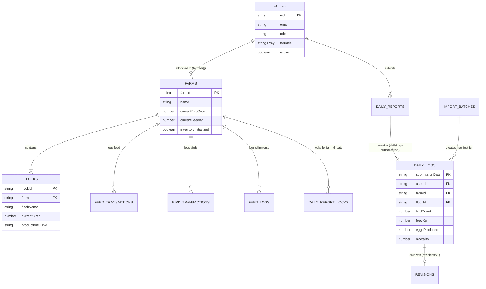

# Backend Schema — Existing Database

## 1. Schema Documentation Rules

This document defines the actual persisted Cloud Firestore data structures and database relationships implemented in **SAI Happy Farms ERP**.

- **Reconstruction Methodology:** Every collection, subcollection, document path, field name, data type, and validation constraint in this document has been extracted directly from the application source code (`frontend/src/`, `backend/src/`), security rules (`firestore.rules`), and test files.
- **Evidence Hierarchy:**
  - `VERIFIED`: Directly observed in Firestore transactions, batch writes, queries, or security rules.
  - `INFERRED`: Derived logically from field usages or normalization fallbacks (explicitly labeled).
  - `LEGACY / ALIAS`: Fields present in historical imported data or earlier schema iterations, handled via normalization mappers.
- **Protection Objective:** Future AI coding agents must treat this schema as strict law. Modifying collection paths, altering field names, or changing data types will immediately corrupt active production data and break analytics dashboards.

---

## 2. Backend Overview

- **Database Technology:** Cloud Firestore (Google Cloud Platform Managed NoSQL Document Database).
- **Client Access Library:** Firebase JS Compat SDK v12.18.0 via CDN (`frontend/src/config/firebase.ts`).
- **Server Access Library:** `firebase-admin` v12.0.0 (`backend/src/config/firebase.ts`).
- **Root Path:** `/databases/{database}/documents/`.
- **Document ID Generation Conventions:**
  - Auto-generated Firestore IDs (e.g., `db.collection('flocks').doc().id`, UUIDv4).
  - Auth UID-keyed documents: `/users/{userId}`, `/dailyReports/{userId}`.
  - Deterministic natural keys: `/farms/AP15`, `/dailyReportLocks/AP15_2026-10-01`, `/dailyReports/{userId}/dailyLogs/2026-10-01`.

---

## 3. Complete Collection Inventory

| Collection / Path | Purpose | Created By | Read By | Updated By | Deleted By | Status |
| :--- | :--- | :--- | :--- | :--- | :--- | :--- |
| `/users` | User accounts, roles, farm allocations, active state | Backend API / Admin SDK | AuthContext, Admin UI | Admin API & Direct SDK | Admin API | **VERIFIED** |
| `/farms` | Farm metadata, master bird count, and feed stock | Backend API / Admin SDK | Dashboards, Farmer Form | Report Tx, Feed Load Tx | Admin API (Cascade) | **VERIFIED** |
| `/farms/{farmId}/feedTransactions` | Immutable log of feed usage and deliveries | Report Tx, Feed Load Tx | Farm Detail, Dashboards | Admin API | Admin API (Cascade) | **VERIFIED** |
| `/farms/{farmId}/birdTransactions` | Immutable log of bird mortality, culling, additions | Report Tx, Flock Creation | Farm Detail, Dashboards | Admin API | Admin API (Cascade) | **VERIFIED** |
| `/flocks` | Layer flock batches, age, standard curve type | Flock Service, Admin API | Dashboards, Farmer Form | Report Tx, Flock Service | Admin API (Cascade) | **VERIFIED** |
| `/dailyReports/{userId}` | Summary parent record of farmer's reporting status | Report Service Tx | Farmer Form | Report Service Tx | Admin API (Cascade) | **VERIFIED** |
| `/dailyReports/{userId}/dailyLogs` | Canonical daily layer performance logs | Report Service Tx | Rankings, Analytics | Report Service (V2) | Admin API (Cascade) | **VERIFIED** |
| `/dailyReportLocks` | Idempotency locks and weekly body weight metrics | Report Service Tx | Report Service, Import | Report Service Tx | Admin API (Cascade) | **VERIFIED** |
| `/logs/{farmId}/feedLogs` | Farm-level audit log of bulk feed loads | Inventory Service | Feed Load Page | Admin API | Admin API (Cascade) | **VERIFIED** |
| `/logs/{farmId}/flockLogs` | Farm-level audit log of flock establishment | Flock Service | Flock Detail Page | Admin API | Admin API (Cascade) | **VERIFIED** |
| `/importBatches` | Batch manifests for historical Excel imports | Import Service | Admin Import Page | Rollback Handler | Admin API | **VERIFIED** |
| `/auditLogs` | Security and administrative audit trail | Backend Audit Service | Security Administrators | Immutable | Admin API | **VERIFIED** |

---

## 4. Detailed Collection Schemas

### 4.1 Collection: `/users`
- **Document Path:** `users/{userId}` (where `userId` is Firebase Auth UID)
- **Document ID:** Firebase Auth UID (`request.auth.uid`).

| Field | Type | Required? | Default | Written By | Read By | Description / Meaning |
| :--- | :--- | :--- | :--- | :--- | :--- | :--- |
| `uid` | `string` | No (inferred from doc.id) | None | Admin API | `userService.ts` | Firebase Authentication UID |
| `name` | `string` | Yes | `''` | Admin API | `AuthContext.tsx` | User's full display name |
| `email` | `string` | Yes | None | Admin API | `AuthContext.tsx` | Login email address |
| `phone_no` | `number \| string` | Yes | None | Admin API | User Management | 10-digit mobile phone number |
| `role` | `string` | Yes | None | Admin API | `AuthContext.tsx`, `firestore.rules` | User role: `'farmer'`, `'supervisor'`, `'admin'` |
| `farmIds` | `string[]` | Yes | `[]` | Admin API, User Service | `AuthContext.tsx`, `firestore.rules` | List of assigned farm identifiers (e.g. `['AP15']`) |
| `active` | `boolean` | Yes | `true` | Admin API, User Service | `AuthContext.tsx`, `firestore.rules` | Account status flag. If `false`, login is blocked |
| `createdat` / `createdAt` | `string \| Timestamp` | Yes | `serverTimestamp()` | Admin API | `reportService.ts` | User creation timestamp (anchor for week calculations) |
| `updatedAt` | `string \| Timestamp` | Yes | `serverTimestamp()` | User Service | Admin UI | Last profile modification timestamp |

---

### 4.2 Collection: `/farms`
- **Document Path:** `farms/{farmId}` (e.g., `farms/AP15`)
- **Document ID:** Sequential Farm ID string (e.g., `AP01`, `AP12`, `AP15`).

| Field | Type | Required? | Default | Written By | Read By | Description / Meaning |
| :--- | :--- | :--- | :--- | :--- | :--- | :--- |
| `farmId` | `string` | Yes | doc.id | Admin API | Dashboards | Unique farm identifier |
| `name` | `string` | Yes | None | Admin API | Dashboards | Descriptive farm name (e.g., `'Happy Farm'`) |
| `location` | `string` | No | `''` | Admin API | Farm Detail | Geographical location or village |
| `active` | `boolean` | Yes | `true` | Admin API | Dashboards | Operational status of the farm |
| `initialBirdCount` | `number` | Yes | `0` | Admin API | Inventory Service | Total birds placed at farm setup |
| `currentBirdCount` | `number` | Yes | `initialBirdCount` | Report Tx, Admin API | Dashboards, Inventory | Live bird population after mortality/culling |
| `initialFeedKg` | `number` | Yes | `0` | Admin API | Inventory Service | Initial feed stock allocated at setup |
| `currentFeedKg` | `number` | Yes | `initialFeedKg` | Report Tx, Feed Load Tx| Dashboards, Inventory | Live available feed stock in kilograms |
| `totalFeedLoadedKg` | `number` | Yes | `initialFeedKg` | Feed Load Tx, Admin API| Dashboards, Inventory | Cumulative feed delivered to this farm |
| `totalFeedConsumedKg`| `number` | Yes | `0` | Report Tx | Dashboards, Inventory | Cumulative feed consumed by flocks |
| `inventoryInitialized` | `boolean` | Yes | `true` | Admin API, Flock Service | `reportService.ts` | Master inventory readiness guard |
| `inventoryInitializedAt` | `string \| Timestamp` | No | `serverTimestamp()` | Admin API | Dashboards | Setup timestamp for inventory |
| `inventoryUpdatedAt` | `string \| Timestamp` | Yes | `serverTimestamp()` | Report Tx, Feed Load Tx| Inventory Service | Timestamp of latest stock recalculation |
| `lastTransactionDate` | `string` | No | `''` | Report Tx, Feed Load Tx| Inventory Service | ISO date (`YYYY-MM-DD`) of latest stock movement |
| `updatedAt` | `string \| Timestamp` | Yes | `serverTimestamp()` | All Services | Dashboards | Document modification timestamp |

---

### 4.3 Subcollections: `/farms/{farmId}/feedTransactions` & `/birdTransactions`
- **Document Path:** `farms/{farmId}/feedTransactions/{txId}`, `farms/{farmId}/birdTransactions/{txId}`
- **Document ID:** Auto-generated Firestore ID (`doc().id`).

#### Fields in `feedTransactions`:
| Field | Type | Required? | Written By | Description |
| :--- | :--- | :--- | :--- | :--- |
| `farmId` | `string` | Yes | Report Tx, Feed Load Tx | Farm identifier |
| `flockId` | `string` | No | Report Tx | Flock ID (if feed usage) |
| `type` | `string` | Yes | All Writers | Transaction type: `'FEED_LOAD'`, `'FEED_USAGE'`, `'FEED_USAGE_CORRECTION'` |
| `feedKg` | `number` | Yes | All Writers | Quantity of feed moved (kg) |
| `reportDate` | `string` | Yes | All Writers | ISO date (`YYYY-MM-DD`) |
| `createdAt` | `string` | Yes | All Writers | ISO 8601 creation timestamp |
| `loadedBy` / `userId` | `string` | Yes | All Writers | UID of operator recording transaction |
| `notes` | `string` | No | All Writers | Optional transaction notes |

#### Fields in `birdTransactions`:
| Field | Type | Required? | Written By | Description |
| :--- | :--- | :--- | :--- | :--- |
| `farmId` | `string` | Yes | Report Tx, Flock Service | Farm identifier |
| `flockId` | `string` | Yes | Report Tx, Flock Service | Flock identifier |
| `type` | `string` | Yes | All Writers | Transaction type: `'INITIAL'`, `'ADDITION'`, `'MORTALITY'`, `'CULLING'` |
| `count` | `number` | Yes | All Writers | Number of birds moved or dead |
| `reportDate` | `string` | Yes | All Writers | ISO date (`YYYY-MM-DD`) |
| `createdAt` | `string` | Yes | All Writers | ISO 8601 creation timestamp |
| `userId` | `string` | No | Report Tx | Operator UID |
| `notes` | `string` | No | All Writers | Transaction remarks |

---

### 4.4 Collection: `/flocks`
- **Document Path:** `flocks/{flockId}`
- **Document ID:** Auto-generated Firestore ID.

| Field | Type | Required? | Default | Written By | Read By | Description |
| :--- | :--- | :--- | :--- | :--- | :--- | :--- |
| `flockId` | `string` | Yes | doc.id | Flock Service | Dashboards | Unique flock identifier |
| `farmId` | `string` | Yes | None | Flock Service | Dashboards, Form | Associated farm identifier |
| `flockName` | `string` | Yes | `'Flock 1'` | Flock Service | Dashboards, Form | Display name (e.g. `'Flock 1'`, `'Flock 2'`) |
| `initialBirds` | `number` | Yes | None | Flock Service | Dashboards | Starting bird count placed in this flock |
| `currentBirds` | `number` | Yes | `initialBirds` | Report Tx, Flock Service | Dashboards, Form | Current live birds in this flock |
| `totalMortality` | `number` | Yes | `0` | Report Tx, Flock Service | Dashboards | Cumulative dead birds in flock life |
| `totalCulling` | `number` | Yes | `0` | Report Tx, Flock Service | Dashboards | Cumulative culled birds in flock life |
| `totalEggs` | `number` | Yes | `0` | Report Tx, Flock Service | Dashboards | Cumulative eggs produced in flock life |
| `startDate` | `string` | Yes | None | Flock Service | Dashboards, Form | Flock placement ISO date (`YYYY-MM-DD`) |
| `currentAgeWeeks` | `number` | Yes | `0` | Flock Service | Dashboards | Calculated age in weeks from placement date |
| `breedType` | `string` | Yes | `'BV-300'` | Flock Service | Dashboards | Bird breed (e.g. `'BV-300'`, `'Lohmann'`) |
| `productionCurve` | `string` | Yes | `'CF_STD'` | Flock Service | Dashboards | Standard curve: `'CF_STD'` or `'FR_STD'` |
| `status` | `string` | Yes | `'active'` | Flock Service | Dashboards | Lifecycle state: `'active'` or `'completed'` |
| `batchNumber` | `number` | Yes | `1` | Flock Service | Dashboards | Sequential batch index for the farm |
| `isInitialFlock` | `boolean` | Yes | `true` | Flock Service | Dashboards | True if first flock established with farm |
| `notes` | `string` | No | `''` | Flock Service | Dashboards | Flock placement notes |
| `createdAt` | `string` | Yes | ISO string | Flock Service | Dashboards | Placement timestamp |
| `updatedAt` | `string` | Yes | ISO string | All Writers | Dashboards | Last update timestamp |

---

### 4.5 Subcollection: `/dailyReports/{userId}/dailyLogs`
- **Document Path:** `dailyReports/{userId}/dailyLogs/{submissionDate}` (or `{date}_{flockId}`)
- **Collection Group:** `dailyLogs` (queried across all users via `db.collectionGroup('dailyLogs')`)
- **Document ID:** ISO date string `YYYY-MM-DD` (e.g., `2026-10-01`).

| Field | Type | Required? | Default | Written By | Read By | Description |
| :--- | :--- | :--- | :--- | :--- | :--- | :--- |
| `userId` | `string` | Yes | Auth UID | Report Service | Analytics | Submitting farmer UID |
| `submittedBy` | `string` | Yes | Auth UID | Report Service | Analytics | Submitting farmer UID |
| `farmId` | `string` | Yes | None | Report Service | Analytics, Rankings | Farm identifier (e.g. `'AP15'`) |
| `flockId` | `string` | Yes | None | Report Service | Analytics | Target flock identifier |
| `submissionDate` | `string` | Yes | None | Report Service | Analytics, Rankings | Report target date in IST (`YYYY-MM-DD`) |
| `submissionMethod`| `string` | Yes | `'DIGITAL_FORM'`| Report Service | Analytics | Channel: `'DIGITAL_FORM'` or `'EXCEL_IMPORT'` |
| `submissionVersion`| `number` | Yes | `1` | Report Service | Analytics | `1` for initial, `2` for farmer revision |
| `status` | `string` | Yes | `'submitted'` | Report Service | Analytics | `'submitted'`, `'corrected'`, `'finalized'` |
| `openingBirdCount` | `number` | Yes | None | Report Service | Rankings, Calculations | Starting live bird count for the day |
| `closingBirdCount` | `number` | Yes | None | Report Service | Analytics | Remaining birds: opening - (mortality + culling) |
| `birdCount` | `number` | Yes | None | Report Service | Rankings, Calculations | Canonical closing bird count |
| `openingFeedKg` | `number` | Yes | None | Report Service | Inventory | Farm feed stock before daily deduction |
| `feedKg` | `number` | Yes | None | Report Service | Rankings, Calculations | Total feed consumed for the day (kg) |
| `closingFeedKg` | `number` | Yes | None | Report Service | Inventory | Farm feed stock after daily deduction |
| `feedGramsPerBird` | `number` | No | Calculated | Report Service | Analytics | Feed consumed per bird: `(feedKg * 1000) / opening` |
| `mortality` | `number` | Yes | `0` | Report Service | Rankings, Calculations | Dead birds recorded for the day |
| `culling` | `number` | Yes | `0` | Report Service | Analytics | Unproductive birds removed for the day |
| `eggsProduced` | `number` | Yes | None | Report Service | Rankings, Calculations | Total gross eggs collected for the day |
| `selectionEggs` | `number` | Yes | None | Report Service | Rankings, Calculations | Table/saleable grade eggs collected |
| `damagedEggs` | `number` | No | `0` | Report Service | Rankings, Calculations | Cracked, broken, or unusable eggs |
| `floorEggs` | `number` | No | `0` | Report Service | Analytics | Eggs laid on shed floor |
| `eggsReceived` | `number` | No | None | Historical Import | Rankings | Explicit received egg count (if from grading center) |
| `temperature` | `number` | Yes | None | Report Service | Analytics | Average ambient temperature (°C) |
| `tempMin` | `number` | No | `temperature` | Report Service | Analytics | Minimum ambient temperature (°C) |
| `tempMax` | `number` | No | `temperature` | Report Service | Analytics | Maximum ambient temperature (°C) |
| `eggWeight` | `map` | Yes | None | Report Service | Rankings, Calculations | Map: `{ min: number, max: number, avg: number }` |
| `bodyWeight` | `map` | No | `null` | Report Service | Analytics | Map: `{ min: number, max: number, avg: number }` |
| `remarks` | `string` | No | `''` | Report Service | Submissions Page | Farmer free-text operational notes |
| `ammoniaPpm` | `number` | No | `null` | Report Service | Analytics | Ambient ammonia level (ppm) |
| `weekNumber` | `number` | Yes | Calculated | Report Service | Rankings, Analytics | Calendar reporting week number |
| `weekLabel` | `string` | Yes | Calculated | Report Service | Rankings, Analytics | Reporting week label (e.g. `'3'`, `'3.1'`) |
| `createdAt` | `string` | Yes | ISO string | Report Service | Analytics | Document submission timestamp |
| `updatedAt` | `string` | Yes | ISO string | Report Service | Analytics | Document update timestamp |

---

### 4.6 Sub-subcollection: `/dailyReports/{userId}/dailyLogs/{submissionDate}/revisions`
- **Document Path:** `dailyReports/{userId}/dailyLogs/{submissionDate}/revisions/v1`
- **Purpose:** Preserves immutable audit copy of initial report when a farmer submits Version 2 correction.
- **Fields:** Complete duplicate of the original Version 1 `dailyLogs` document plus:
  - `archivedAt`: ISO timestamp.
  - `archivedReason`: `'FARMER_CORRECTION_V2'`.

---

### 4.7 Collection: `/dailyReportLocks`
- **Document Path:**
  - Daily Lock: `dailyReportLocks/{farmId}_{submissionDate}` (e.g., `AP15_2026-10-01`)
  - Weekly Metric Lock: `dailyReportLocks/weekly_{farmId}_W{weekNumber}` (e.g., `weekly_AP15_W4`)
- **Document ID:** Deterministic composite string.

#### Fields in `dailyReportLocks`:
| Field | Type | Required? | Written By | Description |
| :--- | :--- | :--- | :--- | :--- |
| `farmId` | `string` | Yes | Report Tx, Import | Target farm identifier |
| `submissionDate` | `string` | No (in daily locks) | Report Tx, Import | Date locked (`YYYY-MM-DD`) |
| `weekNumber` | `number` | No (in weekly locks)| Report Tx | Calendar week number |
| `reportDate` | `string` | No (in weekly locks)| Report Tx | Date weekly metrics were sampled |
| `bodyWeight` | `map` | No (in weekly locks)| Report Tx | Weekly body weight: `{ min, max, avg }` |
| `ammoniaPpm` | `number` | No (in weekly locks)| Report Tx | Weekly ammonia reading |
| `submittedBy` | `string` | Yes | Report Tx | Submitting operator UID |
| `createdAt` / `submittedAt`| `string` | Yes | Report Tx | Creation timestamp |
| `updatedAt` | `string` | Yes | Report Tx | Modification timestamp |

---

### 4.8 Collection: `/logs/{farmId}` and Subcollections `/feedLogs`, `/flockLogs`
- **Document Path:**
  - `logs/{farmId}/feedLogs/{logId}`
  - `logs/{farmId}/flockLogs/{logId}`
- **Document ID:** Auto-generated Firestore ID or flock ID.

#### Fields in `feedLogs`:
| Field | Type | Required? | Written By | Description |
| :--- | :--- | :--- | :--- | :--- |
| `logId` | `string` | Yes | Inventory Service | Log identifier |
| `farmId` | `string` | Yes | Inventory Service | Farm identifier |
| `quantityKg` | `number` | Yes | Inventory Service | Quantity of feed delivered (kg) |
| `previousStockKg` | `number` | Yes | Inventory Service | Stock before delivery |
| `newStockKg` | `number` | Yes | Inventory Service | Stock after delivery |
| `loadedAt` | `string` | Yes | Inventory Service | ISO timestamp of delivery |
| `recordedBy` | `string` | Yes | Inventory Service | Operator display name or UID |
| `notes` | `string` | No | Inventory Service | Delivery slip or driver remarks |
| `type` | `string` | Yes | Inventory Service | Constant `'FEED_LOAD'` |
| `isHistorical` | `boolean` | No | Import Service | True if created during historical import |

---

### 4.9 Collection: `/importBatches`
- **Document Path:** `importBatches/{batchId}`
- **Document ID:** Auto-generated UUID or timestamp-prefixed ID.

| Field | Type | Required? | Written By | Description |
| :--- | :--- | :--- | :--- | :--- |
| `batchId` | `string` | Yes | Import Service | Unique batch identifier |
| `fileName` | `string` | Yes | Import Service | Original Excel spreadsheet name |
| `importTimestamp` | `string` | Yes | Import Service | ISO import execution timestamp |
| `importedBy` | `string` | Yes | Import Service | Admin UID who initiated import |
| `totalRecords` | `number` | Yes | Import Service | Total rows processed |
| `successfulRecords`| `number` | Yes | Import Service | Rows successfully written |
| `failedRecords` | `number` | Yes | Import Service | Rows with processing errors |
| `status` | `string` | Yes | Import Service | `'COMPLETED'`, `'REVERTED'`, `'PARTIALLY_REVERTED'` |
| `manifest` / `targetDocs`| `array` | Yes | Import Service | List of affected documents with prior snapshots |
| `revertedAt` | `string` | No | Rollback Handler | Timestamp of batch rollback |
| `revertedBy` | `string` | No | Rollback Handler | Admin UID who executed rollback |

---

### 4.10 Collection: `/auditLogs`
- **Document Path:** `auditLogs/{logId}`
- **Document ID:** Auto-generated Firestore ID or UUID.

| Field | Type | Required? | Written By | Description |
| :--- | :--- | :--- | :--- | :--- |
| `logId` | `string` | Yes | Audit Service | Audit log entry ID |
| `eventType` | `string` | Yes | Audit Service | Event: `'FARMER_CREATED'`, `'USER_DELETED'`, etc. |
| `uid` | `string` | Yes | Audit Service | Actor UID performing the action |
| `resourceId` | `string` | Yes | Audit Service | Target entity ID (e.g. target UID or Farm ID) |
| `requestId` | `string` | Yes | Audit Service | Request tracing UUID |
| `metadata` | `map` | Yes | Audit Service | Event-specific attributes and previous state |
| `timestamp` | `string \| Timestamp` | Yes | Audit Service | Event occurrence timestamp |

---

## 5. Relationships and Data Dependencies

- **User-to-Farm Relationship:** Denormalized array of plain strings (`farmIds: string[]`) stored on the user document. Not Firestore document references.
- **Farm-to-Flock Relationship:** Stored as plain string `farmId` inside `flocks/{flockId}`.
- **Report-to-Farm Relationship:** Stored as plain string `farmId` inside `dailyLogs` documents.
- **Parent-Child Reports:** `dailyReports/{userId}` is parent document; daily submissions are in subcollection `dailyLogs/{submissionDate}`.

---

## 6. Query and Index Requirements

1. **Collection Group Query on `dailyLogs`:**
   - Query: `db.collectionGroup('dailyLogs').where('submissionDate', '>=', start).where('submissionDate', '<=', end)`
   - Requires composite index: `Collection group: dailyLogs, Fields: submissionDate ASC` (and optionally `farmId ASC`).
2. **Farm Flock Query:**
   - Query: `db.collection('flocks').where('farmId', '==', farmId)`
   - Single field index on `farmId` (built-in).
3. **User Farm Access Query:**
   - Query: `db.collection('users').where('role', '==', 'farmer')`
   - Single field index on `role` (built-in).
4. **Historical Import Batches Query:**
   - Query: `db.collection('importBatches').orderBy('importTimestamp', 'desc').limit(50)`
   - Single field index on `importTimestamp` (built-in).

---

## 7. Data Lifecycle and Referential Integrity

Because Cloud Firestore does not provide native relational foreign key constraints or automatic cascade deletion, referential integrity is maintained programmatically:

1. **Farmer Account Creation:**
   - Handled by `backend/src/services/farmer.service.ts:createFarmer()`.
   - Atomically creates `users/{uid}`, `farms/{newFarmId}`, `flocks/{flockId}`, opening `feedLogs`, and initial transactions.
2. **Farmer Account Deletion:**
   - Handled by `backend/src/services/userService.ts:deleteUserAccount()`.
   - Verifies whether the farmer is the sole owner of their farm(s).
   - If sole owner: deletes `farms/{farmId}` and manually iterates and deletes all subcollections (`feedTransactions`, `birdTransactions`), all associated `flocks`, all `dailyReportLocks`, and the farmer's `dailyReports/{userId}/dailyLogs` subcollection.
   - Cleans up supervisor allocations by filtering out the deleted `farmId` from all supervisor documents.
3. **Daily Report Submissions:**
   - Handled by `frontend/src/services/reportService.ts:submitReport()`.
   - Modifies `dailyReports/{userId}/dailyLogs/{date}`, updates `farms/{farmId}` feed and bird stock, updates `flocks/{flockId}` totals, and logs transaction documents inside a single atomic transaction.

---

## 8. Schema Inconsistencies and Risks

1. **Top-Level vs Subcollection Reports:**
   - Subcollection: `/dailyReports/{userId}/dailyLogs/{submissionDate}` (Standard frontend pattern).
   - Top-Level: `/dailyReports/{reportId}` (Backend API and Historical Import dual-write).
   - *Risk:* Queries that read only root `/dailyReports` will miss reports submitted via the frontend form unless `collectionGroup('dailyLogs')` is used.
2. **Field Name Aliasing in Historical Data:**
   - Bird count exists across datasets as: `birdCount`, `closingBirdCount`, `openingBirdCount`, `noOfBirds`, `currentBirdCount`.
   - Feed consumed exists as: `feedKg`, `feedConsumedKg`, `feedConsumed`, `feed`.
   - Eggs produced exists as: `eggsProduced`, `production`, `totalEggs`, `eggs`.
   - *Mitigation:* The application relies on `normalizeReport()` in `frontend/src/utils/normalizeDailyReport.ts` to map these variants into uniform properties.
3. **Date Formats:**
   - Daily report keys and filter values must remain `YYYY-MM-DD` strings.
   - Do not store raw JavaScript `Date` or `Timestamp` objects in date filter fields, as string comparisons (`>=`, `<=`) will fail.

---

## 9. Schema Change Protection Guide

Before modifying any Firestore collection or field, engineers and AI coding agents must follow this checklist:

1. **Do not rename canonical fields:** Never rename `submissionDate`, `birdCount`, `feedKg`, `eggsProduced`, `mortality`, `selectionEggs`, or `damagedEggs`. These exact names are wired into `kpiCalculations.ts` and `SupervisorRankingsPage.tsx`.
2. **Preserve subcollection paths:** The farmer daily report path must remain:
   `/dailyReports/{userId}/dailyLogs/{submissionDate}`.
3. **Preserve master inventory transaction integrity:** Never write to `dailyLogs` without simultaneously updating `farms/{farmId}` stock counts in the same transaction.
4. **Always use normalization utilities:** When reading reports from Firestore, always pass raw documents through `normalizeReport()` before feeding data into charts or calculation engines.
