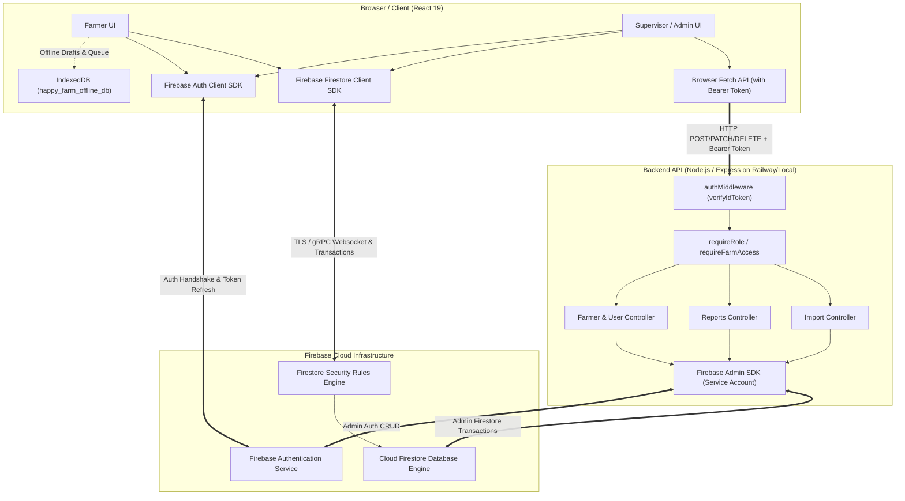
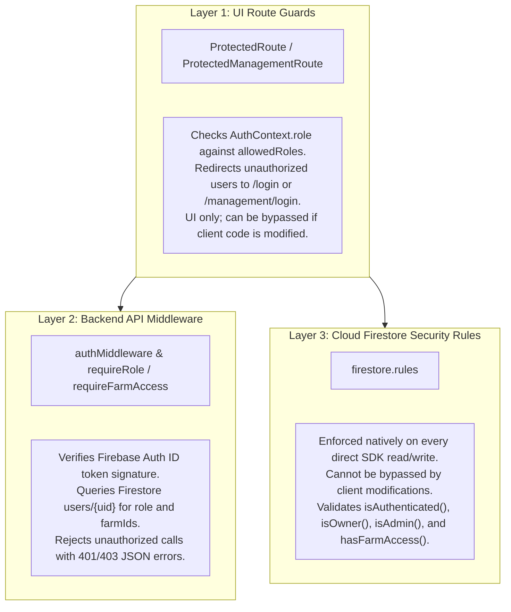
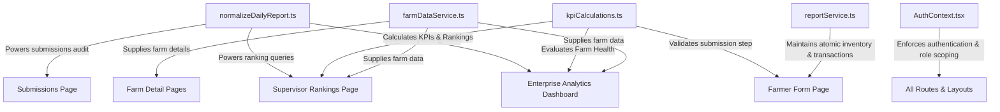

# System Connections — Frontend, Backend and Services

## 1. Connection Overview

The **SAI Happy Farms ERP** application operates as a distributed hybrid architecture combining a React client-side application (Vite SPA) with Firebase Managed Services (Authentication, Firestore, Hosting) and a dedicated Node.js/Express backend API.

Communication occurs across four distinct channels:
1. **Direct Frontend-to-Firebase SDK Connections:** The majority of operational reads, writes, and real-time listeners (daily reporting, farm status, flock status, dashboards, rankings) execute directly from the browser using the Firebase Compat SDK (v12.18.0) governed by Firestore Security Rules.
2. **Frontend-to-Backend REST API Connections:** High-privilege administrative tasks (user creation, user account deletion, Excel export generation, and backend import processing) execute over HTTP/JSON from the browser to the Express API (`/api/v1/*`), authenticated via Firebase Auth ID Bearer tokens.
3. **Backend-to-Firebase Admin SDK Connections:** The Express backend interacts with Firebase Auth and Firestore using `firebase-admin` (v12.0.0) with service account privileges, bypassing Firestore Security Rules to execute atomic transactions, user provisioning, and cascade deletions.
4. **Client-to-IndexedDB Offline Persistence:** Browser-local offline drafts and queued submissions communicate with IndexedDB (`happy_farm_offline_db`) without network dependency.

### 1.1 High-Level Connection Diagram



---

## 2. Frontend-to-Backend Connection Inventory

The table below catalogs all implemented HTTP connections between the frontend React application and the Node.js/Express backend API:

| ID | Feature | Frontend Component | Caller / Handler | Service / Function | Backend Endpoint | HTTP Method | Payload / Data | Status |
| :--- | :--- | :--- | :--- | :--- | :--- | :--- | :--- | :--- |
| **API-01** | Create Farmer Account | `AdminCreateFarmerPage.tsx` | `handleSubmit()` | `userDataService.ts:createFarmer()` | `/api/v1/admin/users/farmer` | `POST` | `{ name, email, phone_no, password, farmName, initialBirdCount, initialFeedKg }` | **VERIFIED** |
| **API-02** | Create Supervisor Account | `AdminCreateSupervisorPage.tsx` | `handleSubmit()` | `userDataService.ts:createSupervisor()` | `/api/v1/admin/users/supervisor` | `POST` | `{ name, email, phone_no, password, farmIds }` | **VERIFIED** |
| **API-03** | Create Admin Account | `AdminCreateAdminPage.tsx` | `handleSubmit()` | `userDataService.ts:createAdmin()` | `/api/v1/admin/users/admin` | `POST` | `{ name, email, phone_no, password }` | **VERIFIED** |
| **API-04** | Update Supervisor Farms | `AdminEditSupervisorPage.tsx` | `handleSave()` | `userDataService.ts:updateSupervisorAllocation()` | `/api/v1/admin/users/supervisor/:uid/farms` | `PATCH` | `{ farmIds: string[] }` (Has Firestore direct fallback) | **VERIFIED** |
| **API-05** | Update User Status | `AdminUsersPage.tsx` | `handleToggleStatus()` | `userDataService.ts:updateUserStatus()` | `/api/v1/admin/users/:uid/status` | `PATCH` | `{ active: boolean }` (Has Firestore direct fallback) | **VERIFIED** |
| **API-06** | Delete User Account | `AdminUsersPage.tsx` | `handleDeleteUser()` | `userDataService.ts:deleteUserAccount()` | `/api/v1/admin/users/:uid` | `DELETE` | None (URL parameter `uid`) | **VERIFIED** |
| **API-07** | Export Production Curve | `ExportReportsCard.tsx` | `handleExport()` | `excelExportService.ts:exportDailyReportsToExcel()` | `/api/v1/reports/export-production-curve` | `GET` | Query params: `startDate`, `endDate`, `farmId` | **VERIFIED** |
| **API-08** | Create Daily Report (Backend API) | Headless / External API | N/A (Frontend uses direct Firestore SDK) | N/A | `/api/v1/reports/daily` | `POST` | `DailyReportInput` JSON | **VERIFIED (Backend)** |
| **API-09** | Get Report by ID | Headless / External API | N/A | N/A | `/api/v1/reports/daily/:id` | `GET` | None | **VERIFIED (Backend)** |
| **API-10** | Backend Import Conflicts | Optional / Alternate Import UI | N/A | `backend/src/controllers/import.controller.ts` | `/api/v1/admin/import/check-conflicts` | `POST` | `{ records: HistoricalImportRecord[] }` | **VERIFIED (Backend)** |
| **API-11** | Backend Import Execute | Optional / Alternate Import UI | N/A | `backend/src/controllers/import.controller.ts` | `/api/v1/admin/import/execute` | `POST` | `{ records: HistoricalImportRecord[], options }` | **VERIFIED (Backend)** |
| **API-12** | Backend Import Batches | Optional / Alternate Import UI | N/A | `backend/src/controllers/import.controller.ts` | `/api/v1/admin/import/batches` | `GET` | None | **VERIFIED (Backend)** |
| **API-13** | Backend Import Revert | Optional / Alternate Import UI | N/A | `backend/src/controllers/import.controller.ts` | `/api/v1/admin/import/batches/:batchId/revert`| `POST` | `{ reason: string }` | **VERIFIED (Backend)** |
| **API-14** | API Health Check | System monitoring | Browser / Curl | `backend/src/index.ts:66-68` | `/health` | `GET` | None | **VERIFIED** |

---

## 3. Firebase Initialization and Shared Instances

### 3.1 Frontend Firebase Initialization
- **Configuration File:** `frontend/src/config/firebase.ts`
- **Underlying Scripts:** `frontend/index.html:12-25` loads Google CDN Compat SDKs:
  - `firebase-app-compat.js`
  - `firebase-auth-compat.js`
  - `firebase-firestore-compat.js`
- **Initialization Logic:**
  - `getFirebaseApp()` checks `window.firebase.apps`. If empty, calls `initializeApp(...)` with:
    - `apiKey`: `VITE_FIREBASE_API_KEY` (fallback: default hardcoded project key)
    - `authDomain`: `VITE_FIREBASE_AUTH_DOMAIN` (`farm-form.firebaseapp.com`)
    - `projectId`: `VITE_FIREBASE_PROJECT_ID` (`farm-form`)
    - `storageBucket`: `VITE_FIREBASE_STORAGE_BUCKET` (`farm-form.firebasestorage.app`)
    - `messagingSenderId`: `VITE_FIREBASE_MESSAGING_SENDER_ID` (`429169430487`)
    - `appId`: `VITE_FIREBASE_APP_ID` (`1:429169430487:web:5de26e54e3fc7b72c18592`)
- **Exported Proxies:**
  - `auth`: JavaScript `Proxy` wrapping `getFirebaseAuth()`. Safely intercepts method calls (`signInWithEmailAndPassword`, `signOut`, `currentUser`) without crashing if the CDN script load is slightly delayed.
  - `db`: JavaScript `Proxy` wrapping `getFirebaseDb()`. Safely proxies calls to `db.collection()`, `db.runTransaction()`, `db.batch()`, etc.
- **Persistence Configuration:**
  - `frontend/src/config/firebase.ts:58-73` executes:
    `db.enablePersistence({ synchronizeTabs: true })`
  - Enables IndexedDB multi-tab offline caching for all Firestore operations.

### 3.2 Backend Firebase Initialization
- **Configuration File:** `backend/src/config/firebase.ts`
- **Initialization Logic (`initializeFirebase()`):**
  - Parses service account credentials with fallback priority:
    1. `process.env['FIREBASE_SERVICE_ACCOUNT_JSON']` (raw JSON string)
    2. `process.env['FIREBASE_SERVICE_ACCOUNT_BASE64']` (base64 encoded JSON)
    3. `path.resolve(process.cwd(), env.FIREBASE_SERVICE_ACCOUNT_PATH)` (local file `service-account.json`)
  - Corrects escaped newlines in private key: `credentialObj.private_key.replace(/\\n/g, '\n')`.
  - Initializes `admin.initializeApp({ credential: admin.credential.cert(credentialObj), projectId })`.
- **Exported Helpers:**
  - `getFirestore()`: Returns root Firestore Admin instance (`admin.firestore.Firestore`).
  - `getAuth()`: Returns root Auth Admin instance (`admin.auth.Auth`).

---

## 4. Authentication Connections

### 4.1 Authentication Architecture Map

```mermaid
flowchart LR
    subgraph Client["Client Tier"]
        LOGIN_PG["LoginPage / ManagementLoginPage"]
        AUTH_CTX["AuthContext (React Context)"]
        USER_SVC["userService.ts: getUserProfile()"]
    end

    subgraph Firebase_Auth["Firebase Auth Tier"]
        SIGN_IN["auth.signInWithEmailAndPassword()"]
        AUTH_STATE["auth.onAuthStateChanged()"]
    end

    subgraph Firestore_DB["Firestore Tier"]
        USER_DOC["/users/{uid}"]
    end

    LOGIN_PG -->|1. Submit email + password| SIGN_IN
    SIGN_IN -->|2. Emit auth state| AUTH_STATE
    AUTH_STATE -->|3. Trigger user detection| AUTH_CTX
    AUTH_CTX -->|4. Query user profile| USER_SVC
    USER_SVC -->|5. Read document| USER_DOC
    USER_DOC -->>|6. Return role, farmIds, active| USER_SVC
    USER_SVC -->>|7. Normalized profile| AUTH_CTX
    AUTH_CTX -->|8. Expose userProfile, role, isAuthenticated| LOGIN_PG
```

### 4.2 Client-Side vs Server-Side Role Resolution
- **Client-Side Resolution:**
  - Handled by `AuthContext.tsx`.
  - `role` is stored as a string field (`role`) directly on the Firestore document `users/{uid}`.
  - The client reads `users/{uid}`, extracts `data.role`, and runs `normalizeRole(role)` (`frontend/src/utils/normalizeRole.ts:1-7`).
  - Route authorization is enforced client-side by `<ProtectedRoute>` and `<ProtectedManagementRoute>`.
- **Security-Rule Enforcement:**
  - `firestore.rules:15-40` replicates role resolution at the database layer.
  - Helper `getUserDoc()` loads `get(/databases/$(database)/documents/users/$(request.auth.uid))`.
  - Helper `hasRole(role)` enforces `isUserActive() && getUserData().role == role`.
  - Helper `hasFarmAccess(farmId)` enforces `isAdmin() || (isUserActive() && (farmId in getUserData().farmIds))`.
- **Backend API Role Resolution:**
  - Handled by `backend/src/middleware/auth.middleware.ts:1-75`.
  - Intercepts `Authorization: Bearer <idToken>`.
  - Calls `admin.auth().verifyIdToken(token)`.
  - Loads Firestore `users/{decodedToken.uid}` to resolve `role` and `farmIds`.
  - Attaches `req.user = { uid, email, role, farmIds }` to Express request object.
  - Role checks enforced by `backend/src/middleware/authorization.middleware.ts:requireRole()`.

---

## 5. Firestore Connection Map

The following catalog defines every Cloud Firestore path accessed by the application:

### 5.1 Collection: `/users/{userId}`
- **Document Path:** `users/{userId}` (where `userId` = Firebase Auth UID)
- **Readers:**
  - `frontend/src/services/userService.ts:getUserProfile()`
  - `frontend/src/services/userDataService.ts:getUserByUid()`, `getAllUsers()`, `getUsersByRole()`, `subscribeToAllUsers()`
  - `backend/src/middleware/auth.middleware.ts`
  - `backend/src/services/farmer.service.ts`, `userService.ts`
  - `firestore.rules:getUserDoc()`
- **Writers:**
  - `backend/src/services/farmer.service.ts:createFarmer()` (creates farmer profile)
  - `backend/src/services/userService.ts:createSupervisor()`, `createAdmin()`
  - `backend/src/services/userService.ts:updateSupervisorAllocation()` (updates `farmIds`)
  - `userDataService.ts:updateSupervisorAllocation()` (client direct fallback)
  - `userDataService.ts:updateUserStatus()` (client direct fallback)
- **Deleters:**
  - `backend/src/services/userService.ts:deleteUserAccount()`
- **Security Rule Enforcement:** Read allowed for self or supervisors/admins; write/delete restricted to admin (`firestore.rules:43-47`).

### 5.2 Collection: `/farms/{farmId}`
- **Document Path:** `farms/{farmId}` (e.g. `farms/AP15`)
- **Readers:**
  - `frontend/src/services/farmDataService.ts:getFarmById()`, `getFarmsByIds()`, `getAllFarms()`, `subscribeToFarm()`, `subscribeToAllFarms()`
  - `frontend/src/services/inventoryService.ts:getBirdInventory()`, `getFeedInventory()`, `subscribeToAllBirdInventories()`
  - `frontend/src/services/reportService.ts:submitReport()` (inside transaction)
  - `backend/src/services/farmer.service.ts`, `farms.service.ts`, `reports.service.ts`
- **Writers:**
  - `backend/src/services/farmer.service.ts:createFarmer()` (creates farm document)
  - `frontend/src/services/reportService.ts:submitReport()` (updates `currentBirdCount`, `currentFeedKg`, `totalFeedConsumedKg`, `inventoryUpdatedAt`)
  - `frontend/src/services/inventoryService.ts:addFeedLoad()` (updates `currentFeedKg`, `totalFeedLoadedKg`)
- **Deleters:**
  - `backend/src/services/userService.ts:deleteUserAccount()` (deletes farm document on sole-owner farmer deletion)
- **Security Rule Enforcement:** Read allowed for active users; create/delete admin-only; update allowed for admin or users assigned to that `farmId` (`firestore.rules:50-54`).

### 5.3 Subcollections: `/farms/{farmId}/feedTransactions` and `/birdTransactions`
- **Document Path:** `farms/{farmId}/feedTransactions/{txId}`, `farms/{farmId}/birdTransactions/{txId}`
- **Writers:**
  - `frontend/src/services/reportService.ts:submitReport()` (logs `MORTALITY`, `CULLING`, `FEED_USAGE`)
  - `frontend/src/services/inventoryService.ts:addFeedLoad()` (logs `FEED_LOAD`)
  - `frontend/src/services/flockDataService.ts:createFlock()` (logs `INITIAL` or `ADDITION`)
  - `backend/src/services/farmer.service.ts:createFarmer()`
- **Deleters:**
  - `backend/src/services/userService.ts:deleteUserAccount()` (cascade deleted on farm deletion)
- **Security Rule Enforcement:** Read/create allowed for users with farm access; update/delete admin-only (`firestore.rules:56-66`).

### 5.4 Collection: `/flocks/{flockId}`
- **Document Path:** `flocks/{flockId}` (auto-generated ID)
- **Readers:**
  - `frontend/src/services/flockDataService.ts:getFlockById()`, `getFlocksByFarmId()`, `subscribeToFlocksByFarm()`, `subscribeToAllFlocks()`
  - `frontend/src/services/reportService.ts:submitReport()`
- **Writers:**
  - `frontend/src/services/flockDataService.ts:createFlock()`, `updateFlock()`
  - `backend/src/services/farmer.service.ts:createFarmer()`
  - `frontend/src/services/reportService.ts:submitReport()` (increments cumulative mortality, culling, eggs)
- **Deleters:**
  - `backend/src/services/userService.ts:deleteUserAccount()` (cascade deleted on farmer deletion)
- **Security Rule Enforcement:** Read/update allowed if user is assigned to `resource.data.farmId`; create/delete admin-only (`firestore.rules:70-74`).

### 5.5 Collection & Subcollection: `/dailyReports/{reportOrUserId}` & `/dailyLogs/{logDate}`
- **Document Path:**
  - Parent Doc: `dailyReports/{userId}`
  - Subcollection Doc: `dailyReports/{userId}/dailyLogs/{submissionDate}` (or `{date}_{flockId}`)
  - Top-Level Report Doc (Legacy/Backend/Import): `dailyReports/{reportId}`
- **Collection Group:** `dailyLogs` (queried via `db.collectionGroup('dailyLogs')`)
- **Readers:**
  - `frontend/src/services/reportDataService.ts:subscribeToAllDailyReports()`, `subscribeToDailyReportsByFarms()` (via `collectionGroup('dailyLogs')`)
  - `frontend/src/services/reportService.ts:subscribeToTodayReport()`
  - `backend/src/repositories/reports.repository.ts:findReportById()`, `getDailyReportsByDateRange()`
- **Writers:**
  - `frontend/src/services/reportService.ts:submitReport()` (writes parent doc and subcollection doc)
  - `frontend/src/services/historicalImportService.ts:executeImportBatch()` (writes subcollection doc and top-level doc)
  - `backend/src/services/reports.service.ts:createDailyReport()` (writes top-level doc)
- **Sub-subcollection:** `dailyReports/{userId}/dailyLogs/{submissionDate}/revisions/v1` (stores version 1 backup on farmer revision).
- **Security Rule Enforcement:** Read allowed for owner, admin, or user assigned to `farmId`; create/update requires farm access; delete admin-only (`firestore.rules:77-110`).

### 5.6 Collection: `/dailyReportLocks/{lockId}`
- **Document Path:**
  - Daily Lock: `dailyReportLocks/{farmId}_{submissionDate}`
  - Weekly Metric Lock: `dailyReportLocks/weekly_{farmId}_W{weekNumber}`
- **Purpose:** Idempotency enforcement, duplicate report prevention, and weekly body weight/ammonia state caching.
- **Readers:**
  - `frontend/src/services/reportService.ts:subscribeToWeeklyMetrics()`
  - `frontend/src/services/historicalImportService.ts`
  - `backend/src/services/import.service.ts:checkConflicts()`
- **Writers:**
  - `frontend/src/services/reportService.ts:saveWeeklyMetrics()`, `submitReport()`
  - `frontend/src/services/historicalImportService.ts`
  - `backend/src/repositories/reports.repository.ts:createReport()`
- **Security Rule Enforcement:** Read allowed for active users; create/update/delete allowed if user has access to `farmId` or is admin (`firestore.rules:113-117`).

### 5.7 Collection: `/logs/{farmId}` and Subcollections `/feedLogs`, `/flockLogs`
- **Document Path:**
  - `logs/{farmId}/feedLogs/{logId}`
  - `logs/{farmId}/flockLogs/{logId}`
- **Readers:**
  - `frontend/src/services/inventoryService.ts:getFeedLogsByFarm()`, `subscribeToFeedLogsByFarm()`
  - `frontend/src/services/flockDataService.ts:getFlockLogsByFarm()`, `subscribeToFlockLogsByFarm()`
- **Writers:**
  - `frontend/src/services/inventoryService.ts:addFeedLoad()`
  - `frontend/src/services/flockDataService.ts:createFlock()`, `syncExistingFlocksToLogs()`
  - `backend/src/services/farmer.service.ts:createFarmer()`
- **Security Rule Enforcement:** Read/create allowed for users with farm access; update/delete admin-only (`firestore.rules:132-147`).

### 5.8 Collection: `/importBatches/{batchId}`
- **Document Path:** `importBatches/{batchId}`
- **Readers:**
  - `frontend/src/services/historicalImportService.ts:fetchImportBatches()`, `rollbackImportBatch()`
  - `backend/src/services/import.service.ts:getImportBatches()`, `getImportBatchById()`, `revertImportBatch()`
- **Writers:**
  - `frontend/src/services/historicalImportService.ts:executeImportBatch()`, `rollbackImportBatch()`
  - `backend/src/services/import.service.ts:executeImport()`, `revertImportBatch()`
- **Security Rule Enforcement:** Admin only (`firestore.rules:127-129`).

### 5.9 Collection: `/auditLogs/{logId}`
- **Document Path:** `auditLogs/{logId}`
- **Writers:**
  - `backend/src/services/audit.service.ts:log()`
- **Readers:**
  - Admin read (`firestore.rules:120-124`).

---

## 6. Frontend State-to-Database Mapping

The lifecycle of daily report data from user input through persistence to display is traced below:

```mermaid
flowchart TD
    subgraph UI_Input["1. UI Input (FarmerFormPage.tsx)"]
        F_FEED["feedQuantity: string = '120'<br/>feedUnit: 'kg' | 'g'"]
        F_MORT["mortality: string = '2'"]
        F_CULL["culling: string = '1'"]
        F_EGGS["eggsProduced: string = '1850'"]
        F_SEL["selectionEggs: string = '1790'"]
        F_DAM["damagedEggs: string = '30'"]
        F_TEMP["tempMin: '24', tempMax: '32'"]
        F_EW["eggWeightMin: '52', eggWeightMax: '58'"]
        F_BW["bodyWeightMin: '1600', bodyWeightMax: '1750'"]
    end

    subgraph Validation["2. Validation (formValidation.ts)"]
        V_CHECK["validateStep() checks:<br/>• Non-negative integers<br/>• Mortality + Culling <= eligible birds<br/>• Eggs Produced <= 95% bird count<br/>• Selection + Damaged <= Eggs Produced<br/>• Temperature between 10°C - 50°C<br/>• Egg weight between 30g - 80g"]
    end

    subgraph Transformation["3. Transformation (reportService.ts)"]
        T_CALC["• feedKg = unit === 'g' ? val / 1000 : val<br/>• openingBirdCount = farm.currentBirdCount<br/>• closingBirdCount = opening - (mortality + culling)<br/>• feedGramsPerBird = (feedKg * 1000) / openingBirdCount<br/>• eggWeight = { min, max, avg: (min+max)/2 }<br/>• weekNumber = calculateReportingWeek()"]
    end

    subgraph Persistence["4. Firestore Document (dailyLogs/{date})"]
        P_DOC["{<br/>  submissionDate: '2026-10-01',<br/>  openingBirdCount: 2000,<br/>  closingBirdCount: 1997,<br/>  birdCount: 1997,<br/>  feedKg: 120,<br/>  feedGramsPerBird: 60.0,<br/>  mortality: 2,<br/>  culling: 1,<br/>  eggsProduced: 1850,<br/>  selectionEggs: 1790,<br/>  damagedEggs: 30,<br/>  temperature: 28,<br/>  tempMin: 24, tempMax: 32,<br/>  eggWeight: { min: 52, max: 58, avg: 55 },<br/>  submissionVersion: 1,<br/>  status: 'submitted'<br/>}"]
    end

    subgraph Consumption["5. Retrieval & Display (SupervisorRankingsPage / Dashboard)"]
        NORM["normalizeDailyReport.ts:<br/>Maps legacy/aliased keys to NormalizedReport"]
        KPIS["kpiCalculations.ts:<br/>• Production Gap % = 92.5% - 80% = +12.5%<br/>• FCR = 120 / (1850 * 55 / 1000) = 1.18<br/>• Egg Damage % = (30 / 1850) * 100 = 1.6%<br/>• Mortality % = (2 / 2000) * 100 = 0.1%<br/>• Selection % = (1790 / 1850) * 100 = 96.8%"]
        UI_DISP["UI Display Cards & Ranking Leaderboard"]
    end

    UI_Input --> Validation
    Validation --> Transformation
    Transformation --> Persistence
    Persistence --> NORM
    NORM --> KPIS
    KPIS --> UI_DISP
```



---

## 7. Realtime Connection Map

The application relies on 7 distinct real-time listeners:

| Listener Target | Path Pattern | Invoked In | Service / Hook | Dependent Components | Cleanup Mechanism |
| :--- | :--- | :--- | :--- | :--- | :--- |
| **All Daily Logs** | `collectionGroup('dailyLogs')` | `useDailyReports.ts` | `subscribeToAllDailyReports` | `EnterpriseAnalyticsDashboard` (Admin) | `unsub()` called on unmount |
| **Farms Daily Logs** | `collectionGroup('dailyLogs')` | `useDailyReports.ts` | `subscribeToDailyReportsByFarms` | `SupervisorRankingsPage`, `EnterpriseAnalyticsDashboard` | `unsub()` called on unmount / farmId change |
| **Today's Report** | `dailyReports/{userId}/dailyLogs/{date}` | `FarmerFormPage.tsx` | `subscribeToTodayReport` | Farmer Form Status & Lock State | `unsub()` called on unmount |
| **All Farms** | `farms` | `EnterpriseAnalyticsDashboard` | `subscribeToAllFarms` | Admin Overview & Farm Filters | `unsubRefs.current` array flush |
| **All Flocks** | `flocks` | `EnterpriseAnalyticsDashboard` | `subscribeToAllFlocks` | Production Curve Overlays | `unsubRefs.current` array flush |
| **Live Inventories** | `farms/{farmId}` (per farm) | `EnterpriseAnalyticsDashboard` | `subscribeToAllBirdInventories` | Bird Population Summary Cards | Iterates array of `unsub()` functions |
| **Feed Logs** | `logs/{farmId}/feedLogs` | `FeedLoadPage.tsx` | `subscribeToFeedLogsByFarm` | Feed Delivery History Table | `unsub()` called on unmount |

---

## 8. Storage and External Integrations

1. **Firebase Storage:**
   - Referenced in config (`storageBucket: 'farm-form.firebasestorage.app'`).
   - *Status:* **PRESENT BUT NOT ACTIVELY CONNECTED IN UI**. The daily reporting form does not currently upload image attachments (e.g., photo of register), keeping data transfer purely text/JSON.
2. **External Telephony / SMS Services:**
   - *Status:* **NOT CONNECTED / SRS ONLY**. Mentioned in SRS, but no external API keys or SDKs (Twilio, Gupshup, Firebase Cloud Messaging) are present in the code.
3. **External Hosting:**
   - Monorepo configured for Vercel (`frontend/vercel.json`) and Firebase Hosting (`firebase.json`).
   - Backend configured for Railway or self-hosted container deployment (`PORT: 3000`).

---

## 9. Authorization and Security Boundaries

Security boundaries are strictly enforced across three distinct layers:



- **Frontend Checks (`Layer 1`):** Navigation guards prevent accidental routing to unauthorized views (`ProtectedRoute.tsx`, `ProtectedManagementRoute.tsx`).
- **Backend Checks (`Layer 2`):** `auth.middleware.ts` decodes and verifies ID tokens; `authorization.middleware.ts` enforces `requireRole(UserRole.ADMIN)` or `requireFarmAccess`.
- **Firestore Security Rules (`Layer 3`):** Authoritative database boundary (`firestore.rules`). Enforces ownership, farm ID access arrays, and administrative privileges.

---

## 10. Critical Dependency Map

The modules below represent shared foundational dependencies across multiple application areas. Changes to these modules will impact several features:



---

## 11. Connection Failure and Recovery

1. **Dual Network Fallback Pattern:**
   - Functions in `userDataService.ts` (`updateSupervisorAllocation`, `updateUserStatus`) first attempt to communicate with the Express backend API.
   - If the backend returns a network failure (`TypeError: Failed to fetch`) or HTTP error, the functions log a warning and execute direct Firestore SDK updates (`db.collection('users').doc(uid).update(...)`).
2. **Offline Draft Queue:**
   - If network connectivity is lost while a farmer is entering data:
     - Form changes are preserved in IndexedDB (`saveFarmerDraft`).
     - If the user clicks Submit while offline, the payload is placed into `pendingSubmissions` with status `PENDING_SYNC`.
     - `syncPendingSubmissions()` checks `navigator.onLine` and flushes queued items once network is restored.
3. **Firestore Reconnection & Offline Cache:**
   - With `synchronizeTabs: true`, Firestore caches local reads and queues writes in browser IndexedDB, syncing with Cloud Firestore automatically when the connection is restored.

---

## 12. Integration Verification Matrix

| Connection Path | Caller | Destination | Code Evidence | Forward Trace | Reverse Trace | Status |
| :--- | :--- | :--- | :--- | :--- | :--- | :--- |
| **Farmer Form $\rightarrow$ Firestore** | `FarmerFormPage.tsx` | `dailyReports`, `farms`, `flocks` | `reportService.ts:submitReport()` | Form submit $\rightarrow$ transaction $\rightarrow$ docs written | `collectionGroup('dailyLogs')` $\rightarrow$ normalized $\rightarrow$ Dashboard | **VERIFIED** |
| **Rankings $\rightarrow$ Firestore** | `SupervisorRankingsPage.tsx` | `collectionGroup('dailyLogs')` | `useDailyReports.ts:61-160` | Hook mount $\rightarrow$ listener $\rightarrow$ `calculateFarmWeeklyKpi` | Daily log write $\rightarrow$ snapshot fired $\rightarrow$ table updated | **VERIFIED** |
| **Admin Create Farmer $\rightarrow$ API** | `AdminCreateFarmerPage.tsx` | `backend/src/controllers/farmer.controller.ts` | `userDataService.ts:createFarmer()` | Form submit $\rightarrow$ HTTP POST $\rightarrow$ Admin SDK Tx | Auth user & Firestore doc created $\rightarrow$ returned to UI | **VERIFIED** |
| **Feed Load $\rightarrow$ Inventory** | `FeedLoadPage.tsx` | `farms/{farmId}`, `logs/{farmId}/feedLogs` | `inventoryService.ts:addFeedLoad()` | Form submit $\rightarrow$ transaction $\rightarrow$ log & farm updated | Farm doc snapshot $\rightarrow$ Inventory summary updated | **VERIFIED** |
| **Import Rollback $\rightarrow$ Batch** | `AdminImportPage.tsx` | `importBatches/{batchId}` | `historicalImportService.ts:rollbackImportBatch()` | Click revert $\rightarrow$ reads manifest $\rightarrow$ reverses docs | Batch status set to `REVERTED` $\rightarrow$ table badge | **VERIFIED** |

---

## 13. Unresolved Integration Questions

1. **Storage Bucket Usage:** The Firebase configuration defines `storageBucket: 'farm-form.firebasestorage.app'`, but no user-facing upload features (e.g., photo of handwritten register) are wired to Cloud Storage in the current codebase.
2. **Backend vs Frontend Excel Generation:** Two Excel export implementations exist:
   - Backend: `/api/v1/reports/export-production-curve` using a child-process script to format workbooks.
   - Frontend: `SupervisorRankingsPage.tsx` using `xlsx` to build multi-tab workbooks entirely in the browser.
3. **Collection Group Index Requirement:** Running `collectionGroup('dailyLogs')` requires a collection group index in Cloud Firestore. If missing in a fresh Firebase project, Firestore throws an index requirement exception containing the direct URL to generate the composite index.
